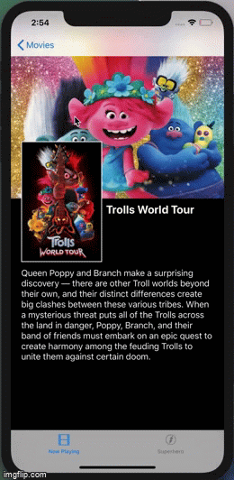
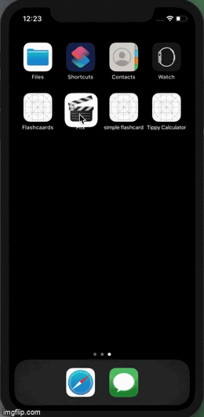

## Flix Part 2

### User Stories

#### REQUIRED (10pts)
- [✔️] (5pts) User can tap a cell to see more details about a particular movie.
- [✔️] (5pts) User can tap a tab bar button to view a grid layout of Movie Posters using a CollectionView.

#### BONUS
- [ ] (2pts) User can tap a poster in the collection view to see a detail screen of that movie.
- [ ] (2pts) In the detail view, when the user taps the poster, a new screen is presented modally where they can view the trailer.

### App Walkthrough GIF

 

### Notes
A challenge that I faced was getting the SuperHero movie grid to show up, even after linking it with the API. 

# Flix-Movie-App

Flix is an app that allows users to browse movies from the [The Movie Database API](http://docs.themoviedb.apiary.io/#).

---

## Flix Part 1

### User Stories
`TODO://` In the **User Stories section below**, add an `x` in the `-[ ]` like this `- [x]` for any user story you complete. (🚫 Remove this paragraph after checking off completed user stories)

#### REQUIRED (10pts)
- [✔️] (2pts) User sees an app icon on the home screen and a styled launch screen.
- [✔️] (5pts) User can view and scroll through a list of movies now playing in theaters.
- [✔️] (3pts) User can view the movie poster image for each movie.

#### BONUS
- [ ] (2pt) User can view the app on various device sizes and orientations.
- [ ] (1pt) Run your app on a real device.

### App Walkthrough GIF

 

### Notes
accidentally stashed my code while figuring out how to pull/push on github and everything I had got deleted. 
